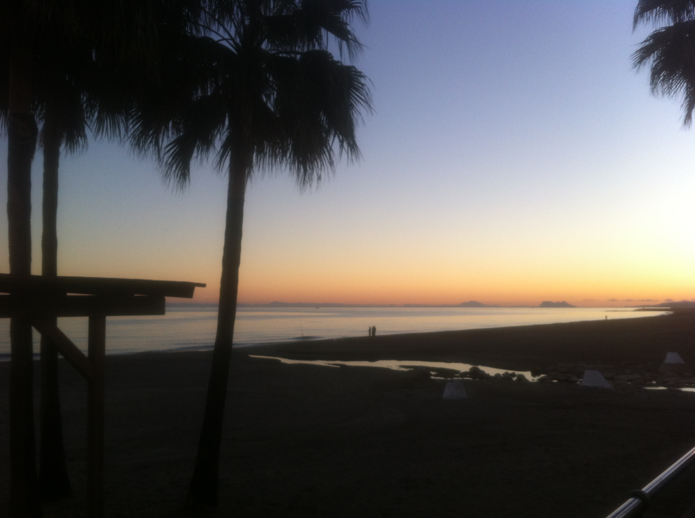

# hw1

## Тарасова Лилия 
*Все обо мне*

~~или биография замечательных людей~~

### Отзывы друзей
>Лиля - мой любимый грузинский цветок! (с) Марья Панова
>>С тобой не страшно садиться в автомобиль, ты прекрасный водитель (с) Марья Панова

***

## Факты из биографии
* Родилась в 1995 году в конце ноября в Москве
* Закончила лицей 1535 в 2013 году
* Рост - 175 см
* Темные глаза и темные короткие волосы
* В ВШЭ с сентября 2013 года
* Владею 2 иностранными языками
* Работала в двух компаниях 
* В этом году получила права 
## Мои плюсы и минусы
#### плюсы
+ Говорят, я красивая
+ Умная
+ Добрая
+ Люблю животных и природу
+ Отличный вкус в кино и музыке
+ Фотографирую 
+ Прекрасно готовлю
#### минусы
- Не могу делать одно и то же долго 
- Пятый год на первом курсе 
- Имею вредные привычки 
- Не умею заводить знакомства
- У меня наверное два друга
- Не хватает терпения 
- Мало читаю (хотелось бы больше)

***

***О моей жизни сейчас*** 

*Живу в загородном доме, планирую переезд обратно в город весной*

*Учусь на первом курсе НИУ ВШЭ департамента иностранных языков, изучаю итальянский*

*Планирую поездку в Ригу на майские праздники*

*По пятницам встречаюсь с друзьями с факультета и мы проводим время с пользой*

*Осваиваю рисование и хожу на тренировки 2-3 раза в неделю*

***

***А это мои планы на ближайший месяц***

- [ ] обновить гардероб
- [x] получить водительское удостоверение
- [ ] встретиться с теми, кого давно не видела
- [ ] записаться на третий иностранный язык

***Мое расписание на неделю в 3 модуле***

Понедельник|Вторник|Среда|Четверг|Пятница
:-:|:-:|:-:|:-:|:-:
Английский 09:00-11:50|Итальянский 16:40-18:00|Латынь 09:00-10:30|Итальянский 10:30-13:30|История Великобритании 13:30-16:30
|ЦГ 13:40-16:30| |НИС 15:00-16:30|Фонетика 15:00-16:30| |

***Меня можно найти в соц.сетях***

[vkontakte](https://vk.com/fodeumaxp)

[instagram](https://www.instagram.com/distantvoicezz/)

либо написать мне на почту:

<lvstarasova@gmail.com>

*Из архивов моих фото*

